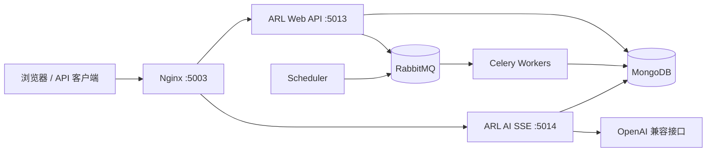
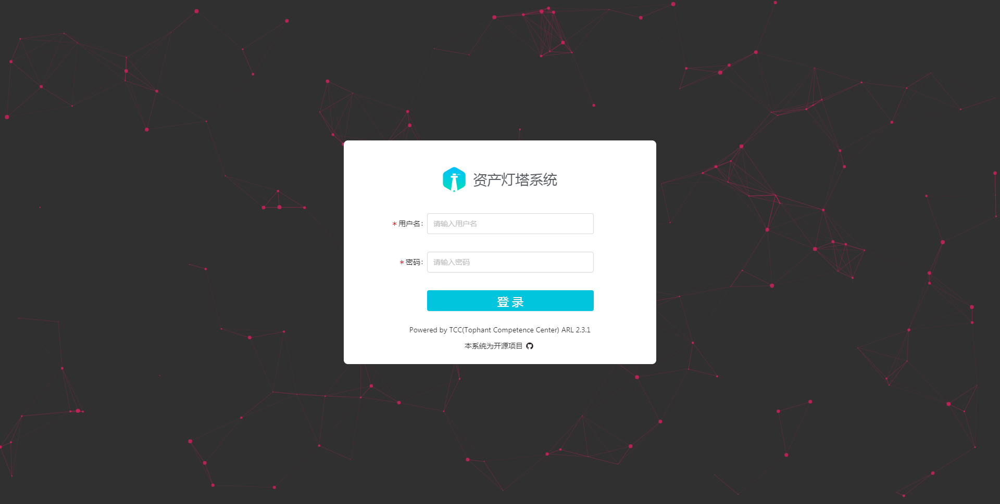
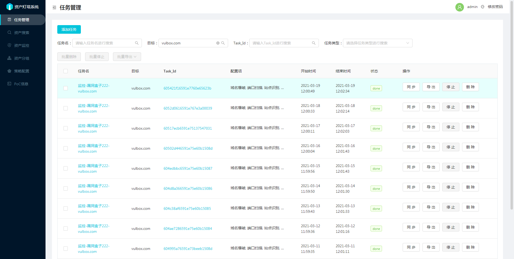
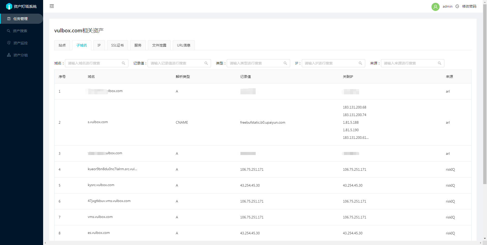
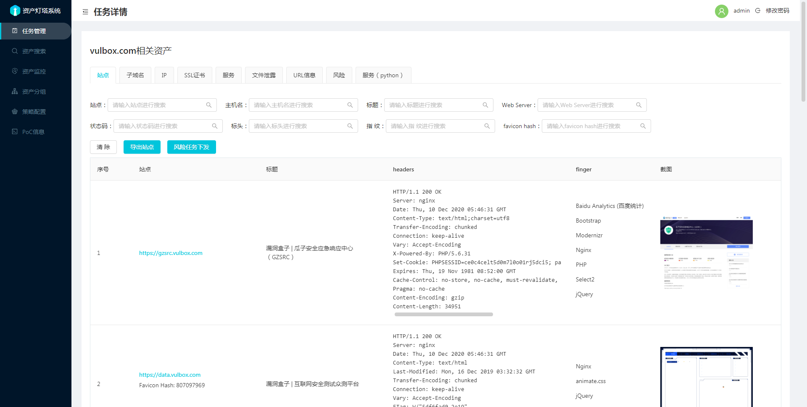
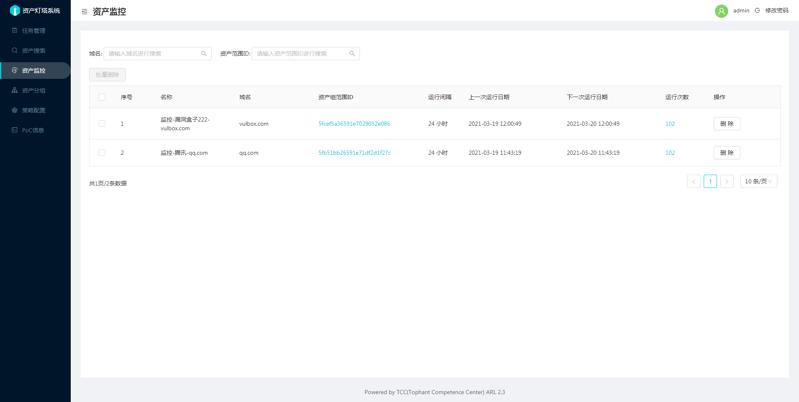
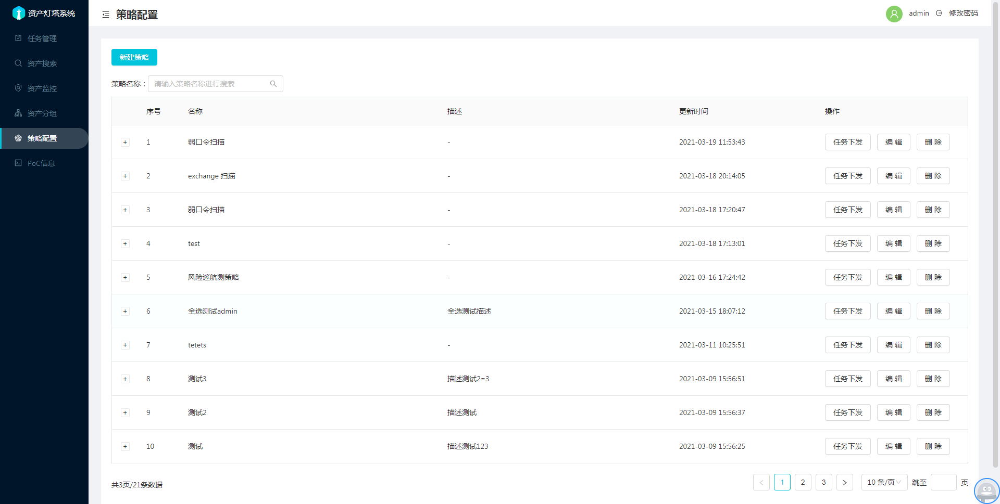
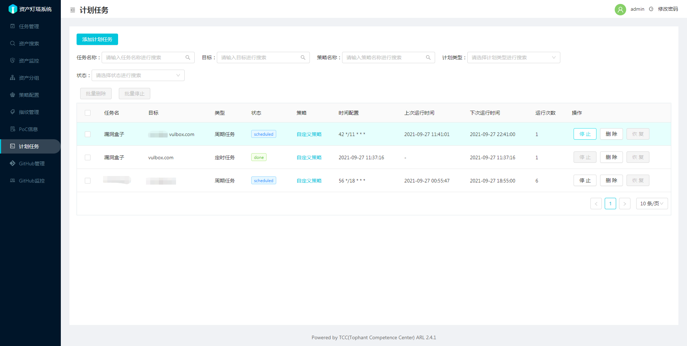
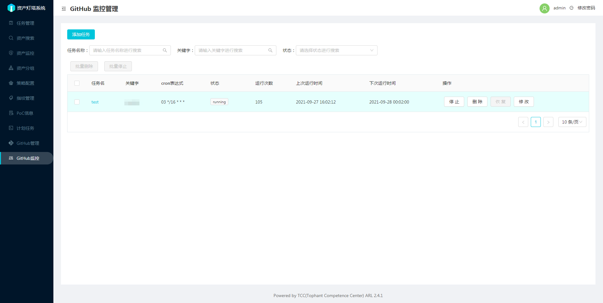

# ARL · 资产侦察灯塔

<p align="left">
  <a href="https://github.com/Sunmedalia/ARL/stargazers"></a>
  <a href="https://github.com/Sunmedalia/ARL/issues"></a>
  
  
</p>

ARL（Asset Reconnaissance Lighthouse）是面向安全团队的资产侦察与暴露面管理平台。它将域名发现、IP 与端口探测、站点识别、漏洞结果、资产监控和计划任务汇总到统一控制台，并提供受限、可审计的原生 AI 助手。

> 本仓库是 ARL 的可运行维护分支，当前运行时为 Python 3.11。仅对已获得明确授权的目标执行侦察或扫描。

## 目录

- [核心能力](#核心能力)
- [系统架构](#系统架构)
- [运行要求](#运行要求)
- [Docker Compose 一键启动](#docker-compose-一键启动)
- [快速开始](#快速开始)
- [生产部署](#生产部署)
- [新版控制台](#新版控制台)
- [AI 控制台](#ai-控制台)
- [配置说明](#配置说明)
- [服务管理](#服务管理)
- [开发与测试](#开发与测试)
- [项目结构](#项目结构)
- [安全说明](#安全说明)
- [常见问题](#常见问题)

## 核心能力

| 类别 | 能力 |
| --- | --- |
| 资产发现 | 域名枚举、DNS 插件查询、IP/IP 段整理、端口扫描、服务与操作系统识别 |
| Web 资产 | HTTP 探测、站点截图、指纹识别、URL 爬取、搜索引擎补充、Host 碰撞 |
| 风险发现 | 文件泄漏、Nuclei、NPoC、弱口令插件、WebInfoHunter |
| 资产运营 | 资产分组、策略、计划任务、域名/IP/站点变化监控、结果导出 |
| 外部情报 | GitHub 关键字搜索与周期监控、FOFA 与多种域名数据源 |
| AI 助手 | 自然语言查询 ARL 数据、工具调用时间线、显式授权后创建资产发现任务 |

常用扫描选项包括：

- 域名爆破、智能字典生成、历史结果复用和第三方域名查询插件；
- 测试端口、Top 100、Top 1000、全端口和自定义端口；
- 服务识别、操作系统识别、SSL 证书采集和 CDN IP 跳过；
- 站点识别、截图、爬虫、文件泄漏、Nuclei 和 WebInfoHunter。

## 系统架构



主要进程：

| 服务 | 作用 | 默认监听/队列 |
| --- | --- | --- |
| `arl-web` | Flask/RESTX 普通 API | `127.0.0.1:5013` |
| `arl-ai` | AI 对话与 SSE 流 | `127.0.0.1:5014` |
| `arl-worker` | 资产发现任务 | `arltask` |
| `arl-worker-github` | GitHub 任务 | `arlgithub` |
| `arl-scheduler` | 周期任务调度 | 内部服务 |
| Nginx | TLS、静态资源和反向代理 | `5003` |

AI 服务与普通 API 分离；模型服务不可用时，不影响资产查询、任务和其他 ARL 功能。

## 运行要求

### 基础组件

- Python 3.11；
- MongoDB；
- RabbitMQ；
- Nmap、MassDNS、Nuclei、NPoC、WebInfoHunter 等扫描工具；
- 构建新版前端时需要 Node.js 22 和 npm。

项目当前保留 MongoDB 4.0 兼容性，因此固定使用 PyMongo 4.12 系列。

### 建议配置

生产或较大规模任务建议至少使用：

- 4 核 CPU；
- 8 GB 内存；
- 10 Mbps 网络；
- 独立数据盘保存 MongoDB 数据。

实际资源消耗取决于目标数量、端口范围、并发设置和启用的扫描模块。请根据授权范围控制扫描速率。

## Docker Compose 一键启动

这是推荐的全新部署方式。Compose 会启动 MongoDB、RabbitMQ、普通 API、AI 服务、两个 Celery Worker、调度器和 HTTPS 网关。网关、API/AI 与扫描 Worker 使用独立镜像，只有扫描 Worker 包含 x86 扫描器并保留 `NET_RAW`、`NET_ADMIN` 能力。

建议使用 Docker Engine 24+ 与 Docker Compose 2.20+。

### 1. 准备环境变量

```bash
cp .env.example .env
```

生产使用前至少修改 `.env` 中的：

- `MONGO_PASSWORD`；
- `RABBITMQ_PASSWORD`；
- `ARL_ADMIN_PASSWORD`。

MongoDB 和 RabbitMQ 密码应使用 URL 安全字符。`.env` 已被 Git 忽略，不要提交真实密码。

默认使用镜像内的 `app/config.yaml.example`。如需自定义扫描策略或现有集成配置，创建本地只读配置挂载：

```bash
cp app/config.yaml.example app/config.yaml
cp compose.override.yaml.example compose.override.yaml
```

然后编辑 `app/config.yaml`。这两个本地文件均不会被提交；MongoDB、RabbitMQ 和 AI 密钥仍由 `.env` 注入。

### 2. 构建并启动

```bash
docker compose up -d --build
```

如果安装的是独立发行的 Compose 2，也可以使用：

```bash
docker-compose up -d --build
```

首次启动需要构建应用镜像、初始化数据库和下载基础镜像，耗时取决于网络。`init` 容器执行完成并显示退出码 `0` 属于正常状态。

### 3. 检查状态

```bash
docker compose ps -a
docker compose logs -f init api worker gateway
```

浏览器访问：

- 旧版控制台：`https://服务器IP:5003/`；
- 新版控制台：`https://服务器IP:5003/next/`。

网关首次启动会生成自签名 TLS 证书，浏览器会提示证书不受信任。生产环境可将受信任证书以 `docker/certs/arl.crt` 和 `docker/certs/arl.key` 只读挂载；启动脚本会复制到证书卷，私钥不得提交；Linux 主机上证书文件需对网关 UID/GID `10001:10001` 可读。

初始管理员来自 `.env`：

- 用户名：`ARL_ADMIN_USERNAME`，默认 `admin`；
- 密码：`ARL_ADMIN_PASSWORD`，默认 `arlpass`。

管理员只在该用户名不存在时创建。数据卷已经初始化后，修改 `.env` 中的管理员密码不会覆盖现有密码，请在控制台中修改。

### 4. 常用命令

```bash
docker compose up -d                 # 启动
docker compose restart api worker   # 重启部分服务
docker compose logs -f               # 查看日志
docker compose down                  # 停止，保留数据
docker compose pull mongo rabbitmq   # 更新基础服务镜像
docker compose up -d --build         # 重新构建并滚动启动
```

彻底删除数据库、队列、证书和运行数据：

```bash
docker compose down -v
```

> `down -v` 不可恢复，请先备份 MongoDB 数据。

可选备份 profile 会定期把压缩的 `mongodump` 存入 `mongo_backups` 卷，周期与保留天数由 `.env` 控制：

```bash
docker compose --profile backup up -d mongo-backup
```

Compose 还通过 `.env` 中的 `ARL_*_CPUS`、`ARL_*_MEMORY` 和 `ARL_LOG_*` 参数提供资源上限与日志轮转。

### 5. 启用 AI

在 `.env` 中设置：

```dotenv
ARL_AI_ENABLED=true
ARL_AI_BASE_URL=https://api.openai.com/v1
ARL_AI_MODEL=your-model-name
ARL_AI_API_KEY=your-api-key
```

然后重建 AI 服务：

```bash
docker compose up -d --force-recreate ai gateway
```

扫描 Worker 默认使用 `linux/amd64`，因为仓库内的 PhantomJS、MassDNS、Ncrack 和 Nuclei 是 x86_64 二进制；API、AI、调度器和网关均使用轻量、非 root 镜像。在 ARM64 主机上只有扫描 Worker 需要 Docker 的 amd64 模拟支持。

## 快速开始

以下流程适用于不使用容器的本地开发。MongoDB、RabbitMQ 和依赖的扫描工具需要预先准备。

### 1. 创建 Python 环境

```bash
git clone https://github.com/Sunmedalia/ARL.git
cd ARL

python3.11 -m venv .venv
. .venv/bin/activate
python -m pip install --upgrade pip
python -m pip install -r requirements.txt
```

### 2. 创建配置

```bash
cp app/config.yaml.example app/config.yaml
```

至少检查以下配置：

- `MONGO.URI` 与 `MONGO.DB`；
- `CELERY.BROKER_URL`；
- `ARL.AUTH`、`ARL.API_KEY`、`ARL.BLACK_IPS` 和 `ARL.FORBIDDEN_DOMAINS`；
- GeoIP、字典和外部工具路径；
- 需要启用的域名查询插件及其密钥。

`app/config.yaml` 已被 Git 忽略，不要将真实凭据提交到仓库。

### 3. 启动后端

开发服务器：

```bash
python -m app.main
```

默认监听 `0.0.0.0:5018`。生产风格启动方式：

```bash
gunicorn -b 127.0.0.1:5013 app.main:arl_app -w 4
```

### 4. 启动 Worker 与调度器

```bash
celery -A app.celerytask.celery worker \
  -l info -Q arltask -n arltask -c 5 -O fair

celery -A app.celerytask.celery worker \
  -l info -Q arlgithub -n arlgithub -c 3 -O fair

python -m app.scheduler
```

### 5. 构建新版前端

```bash
cd frontend
npm ci
npm run build
```

仓库中的 `frontend-dist/` 是已验证的构建产物，源码部署可直接由 Nginx 提供。

## 生产部署

### 自动安装脚本

`misc/setup-arl.sh` 面向支持 `yum` 和 systemd 的 CentOS/RHEL 兼容环境，会安装系统依赖、初始化服务并写入 systemd 单元。建议先阅读脚本，再在全新的专用主机或容器中运行：

```bash
git clone https://github.com/Sunmedalia/ARL.git /opt/ARL
cd /opt/ARL
sudo bash misc/setup-arl.sh
```

脚本会修改软件源、安装系统软件并启停服务，不建议直接在承载其他业务的主机上运行。

### Docker 构建

仓库保留以下容器构建文件：

- `docker/api/Dockerfile`：API、AI、调度器与 GitHub Worker 的轻量非 root 镜像；
- `docker/gateway/Dockerfile`：只包含新旧静态控制台与 Nginx 的非 root 网关镜像；
- `docker/worker/Dockerfile`：包含扫描工具的 x86_64 Worker 镜像；
- `docker/ARMWorker/Dockerfile`：ARM64 扫描 Worker 兼容构建；
- `docker/compose/nginx.conf`：网关 Nginx 配置；
- `docker/config-docker.yaml`：容器配置示例。

根目录 `compose.yaml` 是标准启动入口，`docker/docker-compose.yml` 是兼容入口。只有扫描 Worker 的构建上下文需要 `tools/` 下的扫描器和 GeoIP 数据；API 镜像只保留 Python/NPoC 运行依赖。生产环境应通过 `.env`、只读配置挂载或密钥管理系统注入配置，避免将密码和 Token 写入镜像。

### 初始管理员

使用 `docker/mongo-init.js` 初始化数据库时，默认管理员为：

- 用户名：`admin`
- 密码：`arlpass`

首次登录后必须立即修改密码。首次成功登录会将旧版 MD5 密码自动迁移为 Werkzeug scrypt 哈希。

## 新版控制台

新版 Vue 3 控制台位于 `frontend/`，使用 TypeScript、Vue Router、Pinia 和 Ant Design Vue。

| 路径 | 用途 |
| --- | --- |
| `/next/` | 新版控制台，当前用于迁移验收 |
| `/legacy/` | 旧版控制台 |
| `/` | 迁移期继续提供旧版控制台 |
| `/api/doc` | REST API 文档 |

> **迁移预览状态：** 新版控制台正在 `/next/` 进行功能验收，尚未替代生产入口。验收期间 `/` 与 `/legacy/` 均继续提供旧版控制台；只有关键操作矩阵通过后才会评估切换根路径。

当前迁移预览已提供资产、任务、资产组、监控、策略、计划任务、指纹、PoC、漏洞、GitHub 和 AI 页面。统一 API 客户端负责会话失效、CSRF、分页、请求取消和 SSE 解析。

普通列表接口默认每页 20 条，`size` 最大为 100；完整数据请使用对应的服务端导出操作。部署升级后可运行 `python -m arl_tool.explain_indexes`，使用 MongoDB `explain()` 检查任务、资产组、状态和 `_id` 排序查询是否命中新索引。

前端开发服务器：

```bash
cd frontend
npm run dev
```

## AI 控制台

AI 使用 OpenAI 兼容的 Chat Completions 接口。模型密钥只能从 `ARL_AI_API_KEY` 环境变量读取，不能写入 `app/config.yaml`。

### 1. 启用配置

编辑 `app/config.yaml`：

```yaml
AI:
  ENABLED: true
  BASE_URL: "https://api.openai.com/v1"
  MODEL: "your-model-name"
  TIMEOUT: 120
  MAX_TOOL_ROUNDS: 6
  MAX_RESULTS: 50
  MAX_RESULT_BYTES: 51200
  MAX_CONTEXT_BYTES: 102400
  MAX_STREAMS_PER_SESSION: 2
```

### 2. 设置密钥

手动启动：

```bash
export ARL_AI_API_KEY='your-api-key'
gunicorn -b 127.0.0.1:5014 app.ai_main:ai_app \
  -w 2 --threads 4 --worker-class gthread --timeout 160
```

systemd 部署可创建仅管理员可读的 `/etc/arl/ai.env`：

```text
ARL_AI_API_KEY=your-api-key
```

然后启动服务：

```bash
sudo chmod 600 /etc/arl/ai.env
sudo systemctl daemon-reload
sudo systemctl enable --now arl-ai
```

### 3. 工具与权限边界

AI 只允许调用固定工具：

- 查询任务列表、状态和详情；
- 查询域名、IP、站点、服务和 URL；
- 查询漏洞、Nuclei、文件泄漏、WIH 和 GitHub 结果；
- 查询资产组、策略及 PoC/爆破插件；
- 在显式授权后创建资产发现任务。

AI 不具备以下能力：

- 生成或执行任意 MongoDB 查询；
- 请求任意 URL；
- 执行系统命令；
- 调用任意 ARL 接口；
- 停止、删除或重启任务。

创建任务的授权绑定当前管理员、浏览器会话和当前对话，可随时撤销。工具参数、结果和授权操作会写入审计集合，并通过 TTL 索引保留 90 天。

### 4. AI API

| 方法 | 路径 | 说明 |
| --- | --- | --- |
| `GET` | `/api/ai/status` | AI 配置与可用状态 |
| `GET` | `/api/ai/conversations` | 对话列表 |
| `GET` | `/api/ai/conversations/<id>` | 消息和工具记录 |
| `DELETE` | `/api/ai/conversations/<id>` | 删除本人对话 |
| `POST` | `/api/ai/chat/stream` | SSE 流式对话 |
| `POST` | `/api/ai/grant` | 开启当前对话执行授权 |
| `DELETE` | `/api/ai/grant` | 撤销执行授权 |

SSE 事件固定为：`message_start`、`text_delta`、`tool_start`、`tool_result`、`action`、`done` 和 `error`。

## 配置说明

主要配置文件为 `app/config.yaml`，模板为 `app/config.yaml.example`。

| 配置段 | 用途 |
| --- | --- |
| `MONGO` | MongoDB URI 与数据库名 |
| `CELERY` | RabbitMQ/Celery Broker |
| `ARL` | 鉴权、API Key、目标黑名单、字典和并发参数 |
| `AI` | AI 开关、接口地址、模型和资源限制，不包含密钥 |
| `FOFA` | FOFA 地址、Key 和分页限制 |
| `QUERY_PLUGIN` | 域名查询数据源及各插件参数 |
| `GEOIP` | ASN 与 City 数据库路径 |
| `GITHUB` | GitHub 搜索 Token |
| `PROXY` | HTTP 代理 |
| `DINGDING` / `FEISHU` / `WXWORK` / `EMAIL` | 消息通知 |
| `WEBHOOK` | 监控任务回调 |

敏感配置原则：

- 不提交 `app/config.yaml`；
- 不提交 API Key、Token、密码、证书私钥和本地日志；
- AI 密钥只使用 `ARL_AI_API_KEY`；
- 修改配置或部署文件后先检查 `git diff`。

## 服务管理

安装 systemd 单元后，可以使用：

```bash
systemctl status arl-web arl-ai arl-worker arl-worker-github arl-scheduler
systemctl restart arl-web arl-ai arl-worker arl-worker-github arl-scheduler
```

也可以使用仓库脚本：

```bash
bash misc/manage.sh status
bash misc/manage.sh restart
bash misc/manage.sh log
```

常见日志：

- `arl_web.log`：普通 API；
- `arl_ai.log`：AI SSE 服务；
- `arl_worker.log`：Celery Worker；
- `/var/log/nginx/arl.access.log`：Nginx 访问日志。

## 开发与测试

### 后端

```bash
# 默认套件完全离线
python -m unittest discover -s test -p 'test_*.py'
python -m compileall app arl_tool test

# 仅在 MongoDB、RabbitMQ、网络与扫描器均已准备时运行
python -m unittest discover -s test/integration -p 'integration_*.py'
```

依赖 MongoDB、RabbitMQ、外部 API 或打包扫描器的用例已归入 `test/integration/`，不会被默认离线套件收集。

### 前端

```bash
cd frontend
npm ci
npm test
npm run build
```

### 常用开发入口

```bash
python -m app.main       # Flask 开发服务，端口 5018
python -m app.ai_main    # AI 开发服务，端口 5014
```

## 项目结构

```text
ARL/
├── compose.yaml         # Docker Compose 一键启动入口
├── compose.override.yaml.example # 自定义 YAML 配置挂载模板
├── .env.example         # Compose 环境变量模板
├── app/
│   ├── routes/          # REST API 与 AI 路由
│   ├── services/        # 业务服务和 AI 服务
│   ├── helpers/         # 任务、策略和资产辅助逻辑
│   ├── modules/         # 数据结构与枚举
│   ├── tasks/           # Celery 任务
│   ├── utils/           # 数据库、鉴权和通用工具
│   ├── dicts/           # 字典与规则
│   └── tools/           # 运行时工具
├── frontend/            # Vue 3 前端源码
├── frontend-dist/       # 新版前端构建产物
├── docker/              # 镜像、Nginx 和容器配置
├── misc/                # systemd、安装和管理脚本
├── test/                # unittest 测试
├── tools/               # 外部扫描器与集成
└── arl_tool/            # 独立维护工具
```

## 指纹与 DNS 调优

### 更新指纹

```bash
cd /opt/ARL
python3.11 tools/add_finger.py
python3.11 tools/add_finger_ehole.py
systemctl restart arl-web arl-worker
```

### 使用 SmartDNS

高并发域名解析可以使用本地 SmartDNS。以下仅为示例，请根据网络环境和授权范围调整：

```bash
sudo apt install smartdns
sudo systemctl enable --now smartdns
```

将 ARL 运行环境的首选 DNS 指向 SmartDNS 地址，并保留可靠的备用解析器。不要直接复制未知来源的解析配置到生产环境。

## 截图

| 页面 | 预览 |
| --- | --- |
| 登录 |  |
| 任务 |  |
| 域名 |  |
| 站点 |  |
| 资产监控 |  |
| 策略 |  |
| 计划任务 |  |
| GitHub 监控 |  |

现有截图来自旧版控制台；新版控制台请访问 `/next/`。

## 安全说明

- 仅扫描自有资产或已获得书面授权的目标；
- 使用 `ARL.BLACK_IPS` 和 `ARL.FORBIDDEN_DOMAINS` 阻止不应触达的范围；
- 全端口、漏洞、弱口令、文件泄漏和爬虫功能可能触发告警、封禁或业务压力；
- 生产环境必须启用 TLS、修改默认密码并限制管理端访问来源；
- 不要将 MongoDB、RabbitMQ、普通 API 或 AI 服务直接暴露到公网；
- 发现安全问题时请参考 [SECURITY.md](./SECURITY.md)。

使用本项目即表示你同意遵守 [Disclaimer.md](./Disclaimer.md) 中的免责声明。

## 常见问题

### AI 页面提示不可用

依次检查：

1. `AI.ENABLED` 是否为 `true`；
2. `AI.MODEL` 和 `AI.BASE_URL` 是否正确；
3. `ARL_AI_API_KEY` 是否存在于 `arl-ai` 进程环境；
4. `systemctl status arl-ai` 与 `arl_ai.log`；
5. Nginx 的 `/api/ai/` 是否代理到 `127.0.0.1:5014`。

### MongoDB 出现连接超时

检查 MongoDB 服务、URI、认证信息和容器网络。容器使用 systemd 时，还需要确认 cgroup 挂载和权限是否正确。

### 大量任务导致超时

降低 `arl-worker.service` 的 Celery 并发数，缩小端口范围，并适当降低域名爆破并发。修改后重启 Worker。

### 相关文档

- [ARL FAQ](https://tophanttechnology.github.io/ARL-doc/faq/)
- [WebInfoHunter 功能说明](https://tophanttechnology.github.io/ARL-doc/function_desc/web_info_hunter/)
- [资产分组和监控说明](https://github.com/TophantTechnology/ARL/wiki/%E8%B5%84%E4%BA%A7%E5%88%86%E7%BB%84%E5%92%8C%E7%9B%91%E6%8E%A7%E5%8A%9F%E8%83%BD%E4%BD%BF%E7%94%A8%E8%AF%B4%E6%98%8E)

## License

许可证与第三方组件声明见 [LICENSE](./LICENSE)。
